# Awk-estra

A local, browser-based workbench for `awk`. Drop text into a tab, write awk
against it with a live preview that updates as you type, and save what
works as named snippets — with parameters, tests, and keyboard shortcuts
— then compose them into multi-step chains and pipelines you can rerun,
edit, or copy back out as a shell command or standalone script. Built
around awk's grain: automatic detection of `FS` / `FIELDWIDTHS` / `FPAT`,
a picker for `strftime` of common date/time formats, gawk pretty-printing,
sandboxed runs by default, and a built-in awk reference for quick syntax
lookups. Outside sandbox mode, awk pipes to and from any command-line
program, so chains can stitch in `jq`, `curl`, `base64`, or anything else
on your `PATH` — with a configurable command blocklist and an opt-in
manual-run gate for anything that touches the system. The backend is a
tiny Node server bound to `127.0.0.1` that does nothing but spawn `awk`
— your data and library stay on your machine.

The frontend is vanilla ES modules with no build step.

## Quick start

```bash
# Requires Node >= 18 and gawk (preferred), or awk / mawk.
npm install
npm start
# → http://127.0.0.1:3000
```

Open the page, skim the welcome guide (reopenable from the header `?`
button), and start experimenting.

## What you can do

- **Ad-hoc transforms.** Select text in the editor, press `Ctrl+K` (`⌘+K` on
  macOS), type an awk program, hit Enter. The selection is replaced in
  place, undo-preserving. No selection? The whole buffer is used as input.

  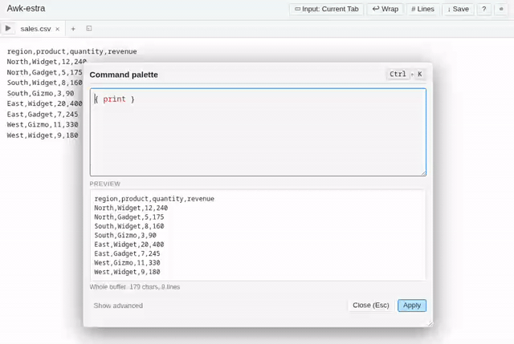

- **Multi-tab input.** The header toggle (**▭ Input: Current Tab** /
  **▦ Input: All Tabs**) switches every run surface — snippet apply,
  chain apply, pipeline, palette, and each dialog's preview — between
  processing just the active tab and every tab that isn't marked
  `excluded`. A live text selection always wins over the toggle, so
  you can bounce between "transform this file" and "transform the
  selection" without flipping anything. Tabs marked `excluded` (from
  the tab's right-click menu) are skipped, handy for scratchpads and
  result tabs that shouldn't feed the next run.

  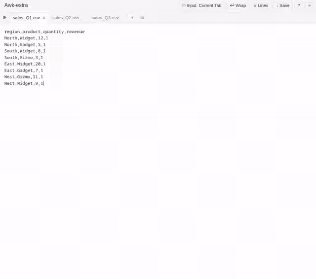

- **Saved snippets.** The sidebar has a library of named awk programs.
  Click one to run on the current selection; `Ctrl+click` runs against an
  empty input and inserts the output at the cursor. Snippets support
  declared parameters surfaced as `-v name=value` at run time, and each
  can be bound to its own keyboard shortcut (Ctrl / Alt / Cmd / Shift
  combos, or a bare `F1`–`F24`). The run-vars prompt has a **Show all**
  toggle for pre-resolved defaults and a **Save as chain…** button that
  freezes the current values into a reusable chain with one click.

  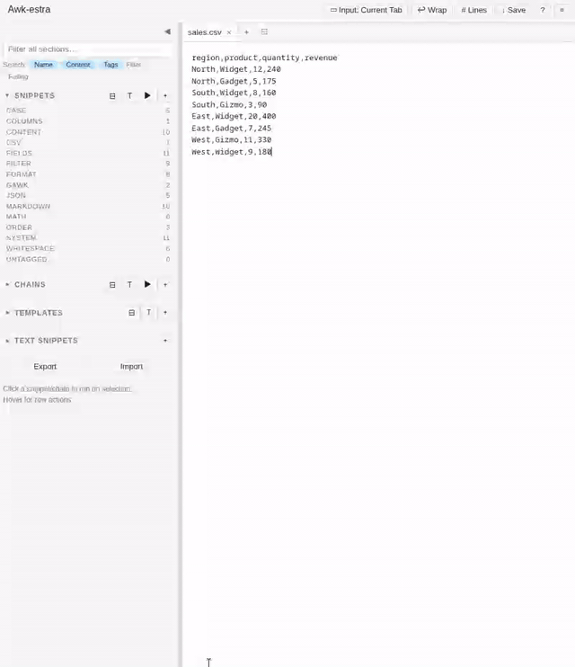

- **Lock outputs with test cases.** Snippet and chain dialogs have a
  **Test cases** section that records an Input + Expected pair and
  compares them against a live run. `+ From preview` captures the
  current input and the program's current output as a new test case
  in one click — turning the preview you're looking at into a
  regression check.

  

- **Detect FS.** A button on the snippet, inline-step, and command-palette
  editors samples the current editor selection and guesses the field
  separator. Tries the common delimiters first (tab, comma, pipe,
  semicolon, colon), then any other punctuation character that splits
  every sampled line into the same number of fields. Writes the match
  into the awk program as a `BEGIN { FS = "…" }` assignment — replacing
  an existing FS in place, or injecting into an existing `BEGIN` block,
  so you never end up with two. On an empty program it also scaffolds
  `{ print $1, $2, …, $N }` so the preview shows every field via OFS.
  Falls back to an _"awk's default FS already works"_ toast for
  whitespace-columnar input (log lines, `ls -l` style). JSON arrays
  short-circuit to a toast that one-clicks a `JSON to Table` chain
  cloned for edit.

  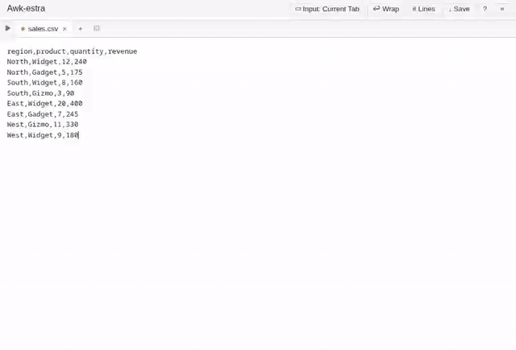

  JSON-array escalation in action:

  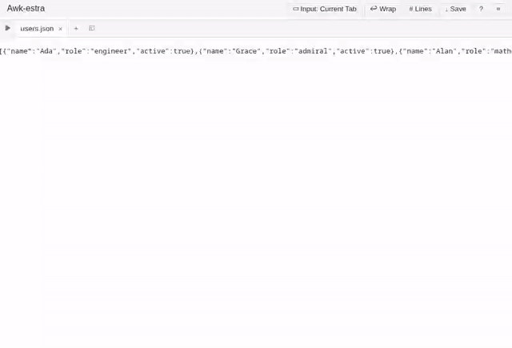

- **Fixed Columns…** Sibling button on the same three surfaces, for
  gawk's `FIELDWIDTHS` (fixed-width columnar data — mainframe exports,
  `ls -l`, `ps aux`, `/proc` files). Opens a picker with the current
  selection sampled under a clickable ruler: click any column — on the
  ruler or directly on a sample character — to toggle a field
  boundary. **Auto-detect** seeds boundaries from columns of spaces
  that align across every sampled line; **Fit** sizes the ruler to the
  widest full-input line; **± N** widens or shrinks the ruler in user-
  chosen increments. The picker auto-runs Auto-detect on first open
  and defaults the trailing-`*` flag (gawk 4.2+ "field extends to end
  of line") to checked. **Insert FIELDWIDTHS** splices the assignment
  using the Detect-FS cascade and always appends `{ print $1, …, $N }`
  so the preview shows every field. Because `FIELDWIDTHS` is gawk-only,
  insert fires a portability toast (each time, by default) with a
  quick-link to the `Warn when inserting gawk-only syntax` setting.
  Seeded `inventory.txt` text snippet exercises the full flow.

  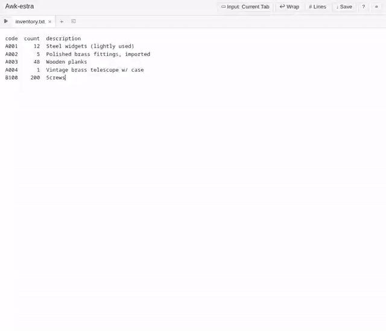

- **Field Pattern…** Third picker on the same three surfaces, for
  gawk's `FPAT` (regex matching what each _field_ looks like, instead
  of what separates them — the classic fix for CSV with commas inside
  quoted fields). Presets cover CSV quoted, CSV RFC 4180, bracketed
  log fields, shell-like quoted args, plain word runs, and a Custom
  regex slot. Live preview colour-codes each matched field inline on
  each sampled line, showing whether your pattern splits the data the
  way you expect. Insert splices `BEGIN { FPAT = "…" }` using the same
  cascade as the other pickers, appends the print scaffold, and fires
  the shared gawk-only portability toast. Seeded `Parse CSV (FPAT)`
  snippet + `quoted.csv` text snippet pair exercises the common case.
  _Caveat — the live preview uses JS regex semantics, which differ
  from gawk's in edge cases (longest-match alternation, POSIX classes,
  empty-match behaviour). Swapping the preview for a real-awk call
  against the sample is a planned follow-up._

  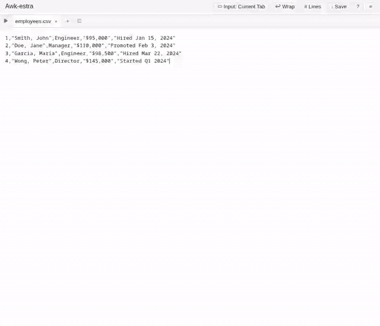

- **Timestamp…** Fourth picker on the same three surfaces, for gawk's
  `strftime()`. Thirteen presets cover ISO 8601 date / date+time, RFC
  3339, US / European dates, 12- / 24-hour times, long-form weekdays,
  Apache access log, syslog, filename-safe, ISO week, Unix epoch, and
  a Custom slot. Live preview renders the format against "now" _and_ a
  fixed reference moment (Tue 5 Mar 2024, 09:07:03) so padding codes
  (`%e`, `%k`, `%l`) and text codes (`%B`, `%A`) produce predictable,
  recognisable output you can map back to the spec. A collapsible
  two-column cheatsheet spells out all 36 format codes. Insert replaces
  the current selection (or drops at the cursor) with
  `strftime("FORMAT")` — a valid expression you can wrap in `print`,
  assign to a variable, or embed in a larger statement. Same gawk-only
  portability toast as the FIELDWIDTHS / FPAT pickers.

  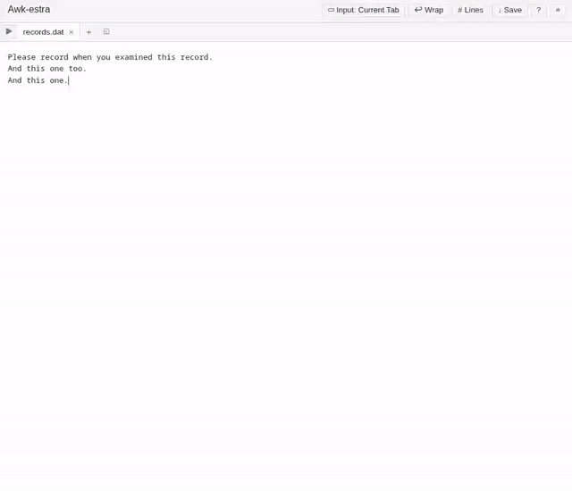

  The FPAT and Timestamp preset lists are editable in
  **Settings → Presets** — edit name / value / description in place,
  drag-to-reorder within a group, add new rows, or revert a built-in
  to its shipped default. The picker reads the live list on every open,
  so saved edits surface immediately.

- **Format** (snippet editor **and** the command palette). Runs the
  current program through `gawk
--pretty-print` on a `POST /format` endpoint: canonical K&R braces,
  one statement per line, spaces around operators. Replaces the whole
  textarea via a single edit so one `Ctrl+Z` rolls back. On parse error
  the gawk stderr surfaces in an alert and the program is left
  untouched. By default the output's leading tabs are replaced with two
  spaces (configurable under **Settings → UI / Layout → Format**) —
  gawk indents with hard tabs, but the program textarea drops Tab
  keystrokes to the next focusable element, so raw tabs leave the
  output un-editable by hand. Only leading indentation is touched —
  tabs inside comments, between code and a trailing `#` comment, or
  inside a regex literal pass through unchanged.

  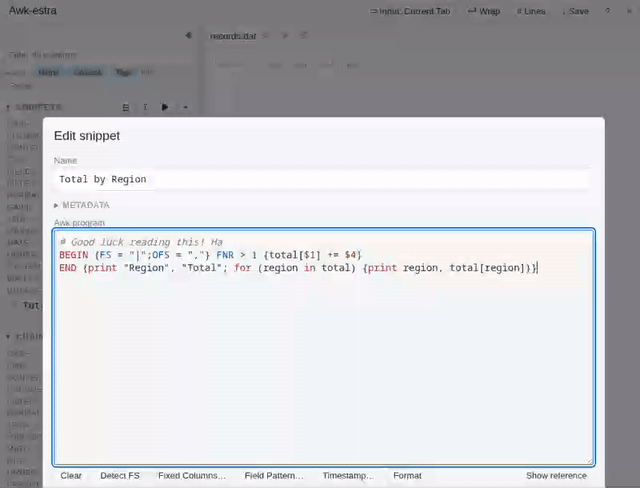

- **Themes.** Sixteen themes ship out of the box: Dark, Light, Dracula,
  Tokyo Night, GitHub Light / Dark, Catppuccin Mocha / Latte, Nord,
  Solarized Light / Dark, Monokai, Gruvbox Dark, One Dark, Ayu Light,
  and High Contrast (for low-vision use). Each is a CSS file in
  `public/themes/` that scopes a block of CSS custom properties under
  `[data-theme="…"]`; the server scans the directory at startup and
  exposes `GET /themes` (list) + `GET /themes.css` (concatenated CSS).
  Drop a new `.css` file in and the server picks it up on the next
  page load via a debounced `fs.watch` on `public/themes/` — no restart
  needed. Already-open tabs need a refresh to see the new theme. In **Settings → UI / Layout → Theme** the selection
  applies immediately — a toast reminds you that closing without Save
  reverts the preview. The default is **Auto (match OS)**: the app
  reads `prefers-color-scheme` and renders in `dark` or `light` to
  match the OS setting, and follows mid-session flips (macOS Auto
  appearance, Windows dark-mode toggle, …) live. Pick any concrete
  theme to opt out of OS-follow.

  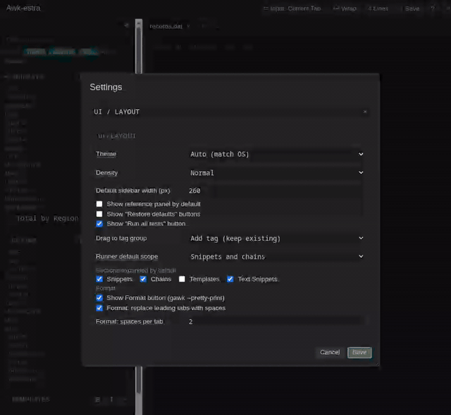

- **Font family + font size.** Editor / snippet / palette monospace
  font is settable in **Settings → Editor**. A curated dropdown lists
  System default, System UI monospace, SF Mono, Menlo, Monaco,
  Consolas, Cascadia Code, Fira Code, JetBrains Mono, Source Code
  Pro, plus a Custom… text input that accepts any CSS font-family
  string. A chosen font that isn't installed cascades through to the
  built-in fallback stack automatically. Font family and size both
  live-preview as you change them; cancel reverts.

  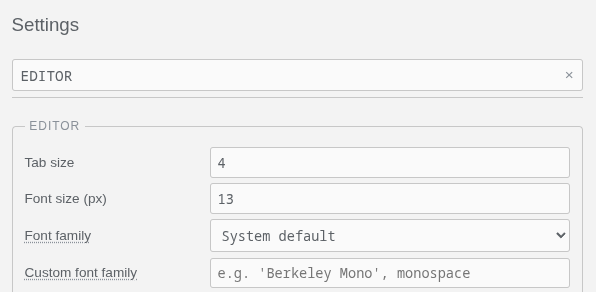

- **Density.** `Compact` / `Normal` / `Roomy` in **Settings → UI /
  Layout** scales buttons, sidebar rows, section headers, tab strip,
  pipeline panels, find bar, dialogs, and most text — the editor
  font-size has its own knob and is unaffected. Two-layer design: a
  handful of hand-tuned `--density-*` tokens for surfaces that don't
  scale linearly well, and a global `--density-scale` multiplier
  (1.0 / 0.8 / 1.2) applied via `calc(X * var(--density-scale))` to
  ~650 font-size / padding / margin / gap declarations so new UI
  surfaces get density-aware sizing automatically.

  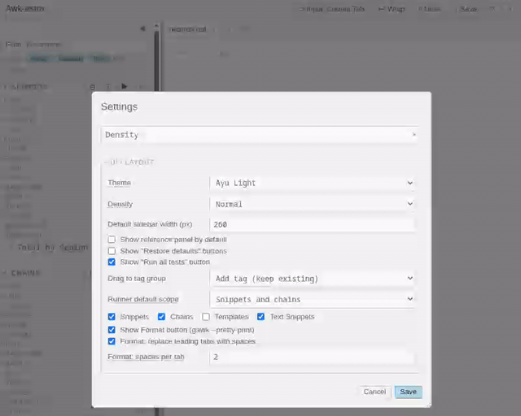

- **Sidebar show / hide.** The `◀` button at the top of the sidebar
  collapses it and frees the space for the editor; when hidden, a `▶`
  button at the top-left of the editor area brings it back. `Mod+B`
  toggles from anywhere (rebindable in Settings → System shortcuts).
  The choice persists across reloads.

  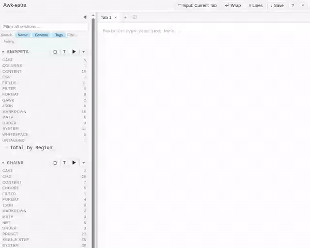

- **Tests.** Attach input / expected-output fixtures to any snippet or
  chain. Run one with the `▶` button, run them all from the section
  header, or filter the sidebar to "Failing" while you iterate.

  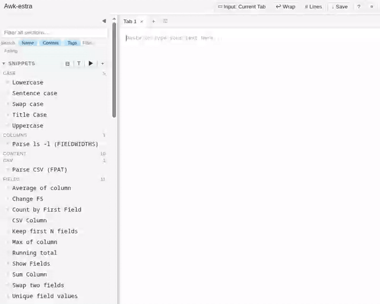

- **Organize.** Tag snippets / chains / templates, drag rows between tag
  groups to re-tag (add or move, configurable), clone / rename / delete
  a tag across a section. Each section has a three-way sort (by tag,
  A-Z, Z-A) and a scoped sidebar filter (Name / Content / Tags).

  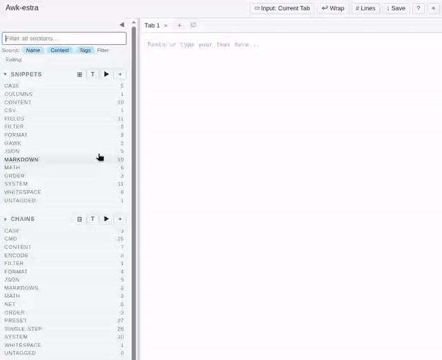

- **Text snippets.** Frequently-pasted bodies of text (CSVs, log samples,
  templates). Clicking opens them in a new tab; `↵` inserts at cursor. A
  starter set seeds on first run — `sales.csv`, `users.json`, `urls.txt`,
  `repos.txt`, and others — so the seed snippets and chains have realistic
  input ready to chew on.

  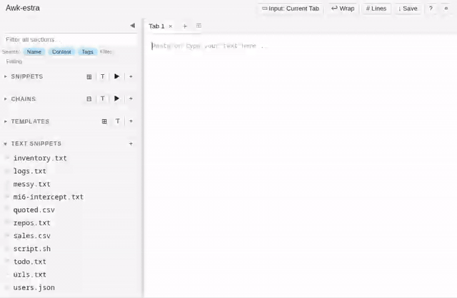

- **Awk templates.** Program skeletons you paste into snippet/palette
  editors, with placeholders.

  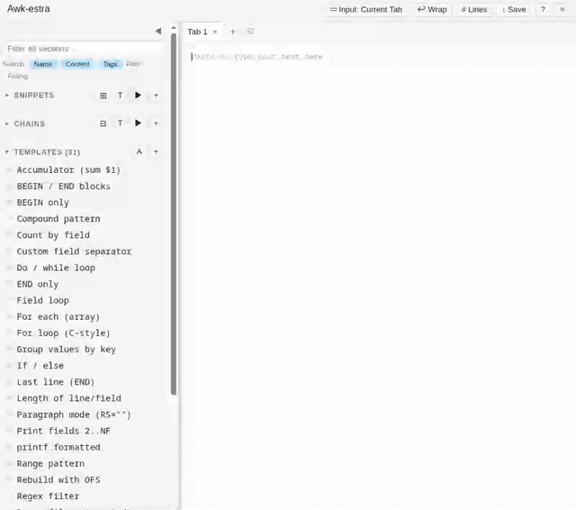

- **Pipelines.** Stack snippets (or ad-hoc inline steps) into a linear
  pipeline. Preview intermediates, copy the equivalent shell
  `awk | awk | …` command, or save the composition as a named **chain**
  for one-click reuse. Inline steps have a **Copy I/O settings from
  preceding steps** button (hidden on the first step where it would
  have nothing to copy) that scans upstream `BEGIN` blocks for
  cross-step vars (`FS`, `OFS`, `RS`, `ORS`, `FIELDWIDTHS`, `FPAT`,
  `CONVFMT`, `OFMT`) and prepends the merged settings into the current
  step's `BEGIN`, so downstream steps don't silently lose an `FS`
  tweak set upstream.

  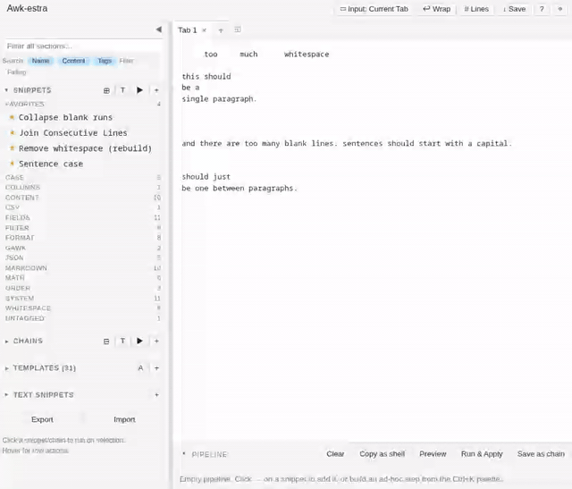
- **Per-step chain variables.** When two steps in a chain declare the
  same `-v` name (think `cmd = base64` then `cmd = base64 -d`), the
  chain dialog's Variables section grows a **Different per step?**
  toggle on the shared row. Expand it and each using step gets its
  own input so the chain can encode in one step and decode in the
  next. Collapsed, every using step sees one value — the common case
  stays a single input. Under the hood the chain stores per-step
  overrides as `chain.stepVars[stepId][name]` and flips precedence
  for expanded names via `chain.perStepNames` so each step's own
  default wins over the shared chain-level value. Step numbers (`1.`,
  `2.`, …) label every surface — the Steps list, the expanded
  variable rows, and the run-time prompt — so two identically-named
  steps (`Run Command (with stdin)`) stay unambiguous. **The pipeline
  panel mirrors the same UX**: load-as-new or append-to-pipeline
  carries `chain.vars`, `chain.stepVars`, and `chain.perStepNames`
  through into `state.pipelineVars` / `pipelineStepVars` /
  `pipelinePerStepNames`, the pipeline's Variables section gets the
  same "Different per step?" toggle and per-step input rows, and
  each pipeline step's label is prefixed with its 1-based position
  so per-step rows align visually with the Steps list. Appending a
  chain whose flat value for a name disagrees with what the pipeline
  currently resolves for that name **auto-engages per-step mode**:
  existing steps' resolved values are snapshotted into
  `pipelineStepVars` so the first chain's value survives, the new
  chain's per-step value attaches to the appended step, and the
  chain-level value from the appended chain becomes the flat
  fallback for any future step with no per-step override. Saving the
  pipeline back as a new chain round-trips per-step values, the
  per-step mode flag, step ids, and chain-level vars intact. `Copy
as shell` and `Download script` from the pipeline then reflect
  exactly what the pipeline panel shows.

  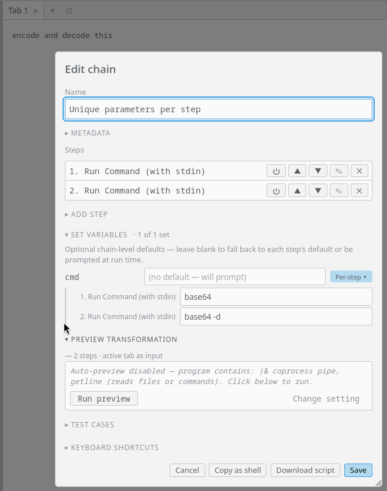

  Copy-as-shell output for the same chain — each step's `awk` invocation gets its own `-v cmd=…` flag:

  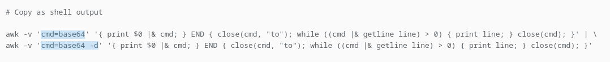

- **Download script.** Any snippet, chain, or inline pipeline step can
  be exported as a standalone script via the **Download script** button
  in its edit dialog. For a snippet or inline step the generated file
  wraps the single program as a one-step pipeline; for a chain the
  whole step list is rendered in order. The generated file's body is a
  user-editable template — see **Settings → Script export** for the
  flatten-each-awk-program toggle, file extension, and the template
  itself. Tokens available: `{SCRIPT_NAME}` (sanitised name + extension),
  `{AWK_PIPE_CMD}`, `{VARIABLES_BLOCK}` (params as
  `NAME="${NAME:-default}"`, empty when none — a `{VARIABLES_BLOCK}`
  sitting alone on its line is dropped entirely in that case so the
  surrounding blanks don't leave a double gap), `{STEP_NAMES_LIST}` /
  `{STEP_NAMES_LIST_NUMBERED}`, and `{USAGE_EXAMPLE}` (which itself
  expands `{SCRIPT_NAME}`). The Template field has a **Reset to
  default** action that appears only while the live value differs
  from the shipped default. The per-step and per-pipeline **Copy as
  shell** buttons are unaffected — they stay one-line clipboard
  output. Per-step chain variables extend the variables block
  automatically: when `chain.perStepNames` lists a name used by at
  least two steps, the script emits one `name_N="${name_N:-default}"`
  line per using step (numbered in step order) and each awk
  invocation references its own numbered var — so an encode→decode
  chain exports as `cmd_1="${cmd_1:-base64}"` /
  `cmd_2="${cmd_2:-base64 -d}"` rather than collapsing to a single
  shared `cmd`. Flat chain vars (and per-step names used by only one
  step) keep the legacy unnumbered form.

  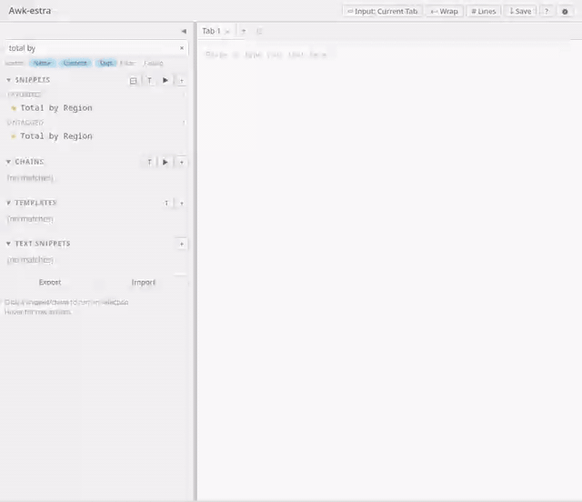

  The same encode→decode chain exported as a script — note the numbered
  `cmd_1` / `cmd_2` shell vars and the per-step `awk` invocations:

  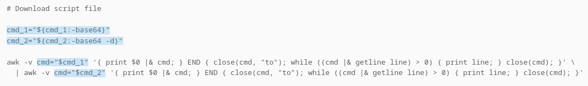

- **Runner (`Ctrl+O`).** A typeahead modal that lists every snippet
  **and** chain; chips scope the list (Snippets / Chains / both).
  `Enter` runs the highlighted item against the selection; clicking a
  row runs it immediately too. `Ctrl+Shift+O` runs with empty input
  and inserts at the cursor. A **📌 pin** in the header toggles a
  session-scoped "keep open after run" mode so you can fire several
  snippets in a row without reopening; **Shift+Enter** (or
  Shift-click) fires one keep-open run without latching the pin.
  After any run the transformation's output is left selected on the
  editor so the next queued run chains off it; on final close the
  selection collapses to a caret at the end.

  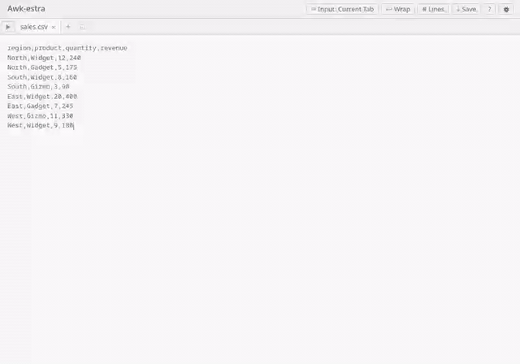

- **Find / replace.** `Ctrl+F` / `Ctrl+H`, plain or regex, with a live
  highlight overlay that stays aligned during scroll.

  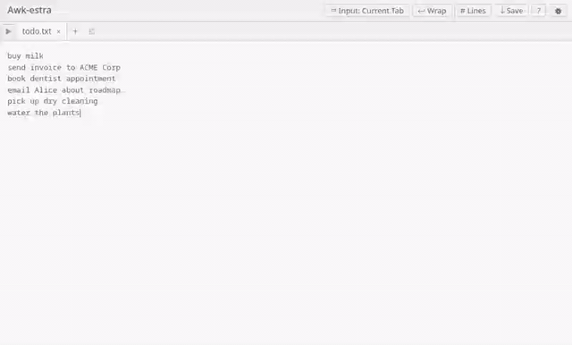

- **Multiple tabs.** Drop a file onto the editor to open it as a new tab;
  arrow keys navigate the tab strip. Right-click a tab for
  close/duplicate/rename/download and bulk-close actions (others, left,
  right, all); middle-click to close; hover a truncated title for the
  full tooltip. Pin a tab to keep it leftmost and shield it from bulk
  closes; click the pin dot to unpin. Drag tabs to reorder; hold Shift
  while dropping to merge the source tab's content into the target.
  The merge separator (`---` line, blank line, or none) is configurable
  in Settings → Editor. _Caveat — when a Shift+drop merge crosses tabs
  (target wasn't already active), Ctrl+Z reverts the merge itself but
  not earlier edits in the target tab. The browser's textarea undo
  stack is per-textarea-session, and a tab switch reloads the
  textarea's value, which clears that history. Merging into the
  already-active tab undoes cleanly; cross-tab merges undo the merge
  only._ `Ctrl+P` opens a quick-switcher with fuzzy
  filter over titles and content; recently-active tabs float to the top.
  Tabs opened from a text snippet show a small amber dot when their
  content diverges from the source. Right-click → "Save as text
  snippet…" captures the current tab content into the library.
  Ctrl/⌘-click the **+** button for a truly blank tab that skips your
  configured default new-tab text. The **⧱** button next to **+**
  opens the workspaces dialog — save the current tab set under a
  name, then restore it later.

  `Ctrl+P` quick-switcher in action:

  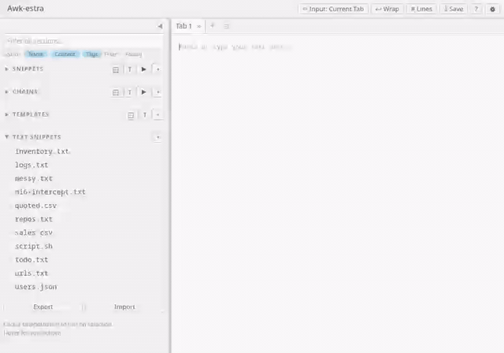

  Saving, closing, and restoring a workspace:

  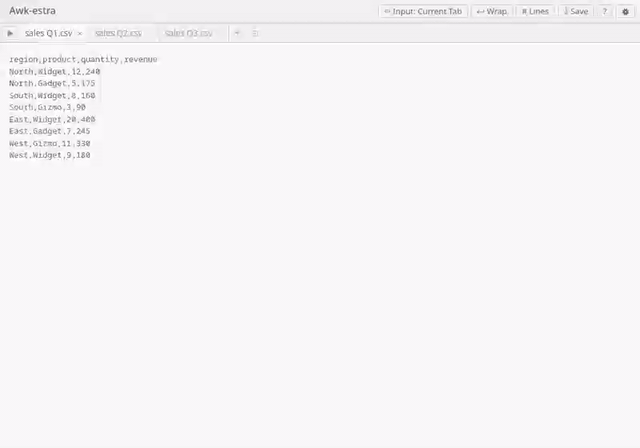

## Keyboard shortcuts

| Shortcut                   | Action                                   |
| -------------------------- | ---------------------------------------- |
| `Ctrl+K` (`⌘+K`)           | Open the command palette (ad-hoc awk)    |
| `Ctrl+O` (`⌘+O`)           | Open the Runner (snippet / chain picker) |
| `Ctrl+Shift+O`             | Runner in insert-at-cursor mode          |
| `Ctrl+F`                   | Find                                     |
| `Ctrl+H`                   | Find & replace                           |
| `Ctrl+G`                   | Go to line                               |
| `Ctrl+P`                   | Open tab quick-switcher                  |
| `Ctrl+B`                   | Toggle sidebar visibility                |
| `Ctrl+Z` / `Ctrl+Y`        | Undo / redo (native textarea stack)      |
| `Esc`                      | Close the open palette / find panel      |
| `←` / `→` / `Home` / `End` | Move focus within the tab strip          |
| `Delete` (on focused tab)  | Close that tab                           |
| Middle-click tab           | Close that tab                           |
| Right-click tab            | Tab actions menu                         |

Per-snippet shortcuts are configured in the Edit-snippet dialog (or
Settings → Snippet keyboard shortcuts) and fire the snippet on the
current selection from anywhere outside an open dialog. The app-owned
shortcuts above (palette, runner, find, find-and-replace, jump-to-line)
are **also user-rebindable** via **Settings → System shortcuts**; the
keydown dispatcher reads from `effectiveSystemShortcuts(settings)` so
overrides take effect the moment you hit Save.

## Configuration flags

```bash
npm start             # default: gawk --sandbox for every run
npm run start:unsafe  # drop --sandbox (also honored via UNSAFE_AWK=1)
npm run start:prod    # NODE_ENV=production
```

`PORT=3099 npm start` overrides the bind port. The server always binds to
`127.0.0.1` — never exposed to the network.

## Safety

Awk is powerful — it can run shell commands (`system("…")`), open pipes to
other processes (`| "cmd"`, `|& "cmd"`), and read or write files
(`getline < "…"`, `print > "…"`). Combined with **auto-preview** — which
re-runs a program on every keystroke — this creates a foot-gun most
scripting tools don't have:

- Typing `system("rm -rf /")` letter by letter fires intermediate
  partial commands along the way.
- Typing `system("mkdir apple")` can create the directories `a`, `ap`,
  `app`, `appl`, and `apple` on the way to the final program.

Three layers of protection address this.

### Default (safe) mode

`npm start` runs the server with `gawk --sandbox`, which disables:

- `system()`
- `getline` from files or commands
- `print` / `printf` redirection (`>`, `>>`)
- Pipes to or from a command (`|`, `|&`)
- Loading of dynamic gawk extensions

Under the sandbox, the built-in "Run Command" snippets and the shell-assist
chains (anything tagged `preset`) simply fail with an awk error — nothing
is executed. You can type, paste, and experiment without risk.

When a program trips the sandbox, the returned error is annotated with a
short hint enumerating what's blocked and the two commands for
restarting in unsafe mode — so the error is self-explaining instead of
just `fatal: redirection not allowed in sandbox mode`.

### Unsafe mode

You leave sandbox mode two ways:

- Start with `npm run start:unsafe` (or set `UNSAFE_AWK=1`).
- Pick `awk` or `mawk` as the binary in Settings — `--sandbox` is a
  gawk-only flag, so it's silently dropped for other interpreters.

In unsafe mode, shell-out, file I/O, and redirections all work. The Run
Command snippets and every chain tagged `preset` depend on this. To keep
the foot-gun contained, the app then turns on three built-in safeguards:

1. **A persistent red banner** at the top of the page reminds you the
   sandbox is off. It only appears when the server reports
   `sandboxEnforced: false`.

2. **Auto-preview is gated** whenever a program contains a side-effecting
   construct (`system(`, `|`, `|&`, `getline`, `print > "…"`). The preview
   pane shows a one-line explanation, a **Run preview** primary button,
   and a secondary **Change setting** link that opens Settings scrolled
   to the exact row that controls the gate (with a brief flash so you
   can't miss it). Nothing executes until you click Run preview.
   Pure-awk programs (no shell-out, no file I/O) still auto-preview
   normally. Detection is token-aware, so a `|` inside a regex
   alternation or string literal does not count. If this gate is more
   friction than you want, **Settings → Safety → Auto-preview programs
   with side effects** opts back into auto-preview for side-effect
   programs (off by default; overridden by "Always require manual
   preview" if that's on).

3. **Forbidden patterns block execution outright.** Any run — preview,
   selection transform, chain step, test — is rejected with an error when
   the awk source or any variable value matches a configured regex
   (JavaScript syntax, case-insensitive). The block surfaces two ways: a
   transient toast with an **Open safety settings** action (jumps
   straight to the forbidden-patterns row, flashing it) and a durable
   inline **Change setting** link in every stderr pane that renders the
   `Blocked by safety filter:` message — so once the toast fades you
   still have a direct handle to fix the list. Each default rule covers a
   family of destructive commands rather than one literal string, so
   flag-order, URL, and shell-variant shuffling doesn't let something slip
   through. The default list ships with patterns for:
   - `rm -rf /` | `~` | `$HOME` — any flag order (`-rf`, `-fr`, `-Rf`,
     `--recursive --force`); plus `sudo rm` with any recursive flag.
   - The classic fork bomb `:(){ :|:& };:`.
   - `mkfs.<fs>` and `mkfs -t <fs>`.
   - `dd of=/dev/<disk>` (disk destruction — benign loopback writes to
     regular files are not caught).
   - Shell redirects to a block device (`> /dev/sda`, `/dev/nvme…`).
   - `shutdown -h|-P|-r|-k`.
   - `curl … | sh` and every shape around it — any URL, any flags,
     optional `sudo`, piped into `sh`/`bash`/`zsh`/`dash`/`ksh`/`ash`;
     also covers `bash -c "$(curl …)"` and `bash <(curl …)`. `wget` and
     `fetch` are covered in the same rules.

   Edit the list in **Settings → Safety**. Each non-empty line is a
   regex (case-insensitive); lines starting with `#` are comments — the
   default list uses them to explain what each rule catches. Blank lines
   and invalid regex are skipped (the latter with a console warning).

   Two affordances in the same panel make the list easier to trust:
   - **Test a command** — a live input that runs your typed command
     through the exact matcher the app uses, showing a red "Prevented"
     (with the matched substring and pattern) or green "Allowed" verdict
     on every keystroke. No Save needed — it reads the textarea as you
     edit.
   - **Saved command checks** — a collapsible section of pinned
     assertions, each `{ command, expect: prevent | allow }`. All rows
     re-run on every edit of the regex list; the header shows `all N
passing` or `F of T failing`, and the section auto-opens whenever a
     row is failing. Seeded with one check per example listed in the
     default patterns' comments — a regression in a regex tightens or
     loosens a known case and the right row lights red immediately.

   This is a speed-bump against pasted / mis-typed destructive commands
   — not a security boundary. A determined author can evade it with
   string concatenation.

### Recommended posture

- If you don't need shell-out, leave the server on its default sandbox
  mode. Most of the snippet library works there.
- If you do need shell-out, review a new program before hitting **Run
  preview** for the first time.
- Add your own danger-regex for workflow-specific risks (e.g.
  `\baws\s+s3\s+rm\b`, `\bterraform\s+destroy\b`,
  `\bgit\s+push\b[^\n]*--force`).
- Toggle **Settings → Safety → Always require manual preview** if you
  prefer every preview to be explicit regardless of content.

See [SECURITY.md](./SECURITY.md) for the full threat model, CSRF posture,
and sandbox semantics.

## Development

```bash
npm run typecheck   # tsc against jsconfig.json (JSDoc-checked .js)
npm run lint        # ESLint flat config
npm run format      # Prettier
npm test            # node:test — 256 unit + server integration tests (~5s)
```

The frontend is a pure ES-module app served from `public/`. No bundler, no
transpile step — edit and refresh.

### Syntax-highlight coverage

The awk tokenizer / highlighter (`public/js/awk.js` + `public/js/data.js`)
always recognises POSIX keywords, builtins, and special variables. Common
gawk extensions are **also** highlighted when
**Settings → UI / Layout → Highlight syntax of gawk-specific extensions**
is on (the default). Flip the setting off for a pure-POSIX view — e.g.
when writing programs that must run under mawk or one-true-awk, where
gawk names would run as plain identifiers anyway.

Two adjacent settings control **which** gawk-only affordances the UI
exposes rather than just which names it highlights:

- **Hide non-POSIX feature buttons (FIELDWIDTHS, FPAT, strftime)** —
  removes the Fixed Columns / Field Pattern / Timestamp picker buttons
  from the palette, snippet editor, and inline pipeline step editor.
  Useful when targeting POSIX awk / mawk / one-true-awk. Off by default.
- **Hide Format button (gawk --pretty-print)** — removes the Format
  button from the snippet editor. `--pretty-print` is a gawk-only flag,
  so this is the one toggle that also matters for users with only
  mawk / one-true-awk installed on the server. Off by default.

The gawk extensions included when the setting is on:

- **keywords**: `func`, `nextfile`, `switch`, `case`, `default`
- **builtins**: `systime`, `strftime`, `mktime`, `gensub`, `asort`, `asorti`, `patsplit`, `isarray`, `typeof`, `compl`, `and`, `or`, `xor`, `lshift`, `rshift`, `mkbool`
- **vars**: `PROCINFO`, `FIELDWIDTHS`, `FPAT`, `IGNORECASE`, `RT`, `ERRNO`, `ARGIND`, `LINT`, `TEXTDOMAIN`, `SYMTAB`, `FUNCTAB`, `BINMODE`

Intentionally **not** recognised yet — will be added if / when a seed
snippet or chain starts reaching for them:

- **lexer directives** starting with `@` (`@include`, `@load`, `@namespace`) —
  these need tokenizer support, not just a keyword list

Unknown identifiers render as plain text, so programs using the omitted
names work fine — they just don't get the colour treatment. Toggling the
setting re-paints every already-open awk textarea immediately via a
`awk-vocabulary-changed` DOM event that each attached highlighter listens
for.

## Further reading

- [ARCHITECTURE.md](./ARCHITECTURE.md) — how the server stays a thin
  gawk shell, how the frontend modules fit together, and the data
  model.
- [SECURITY.md](./SECURITY.md) — threat model, CSRF posture, sandbox
  semantics, known limits.
